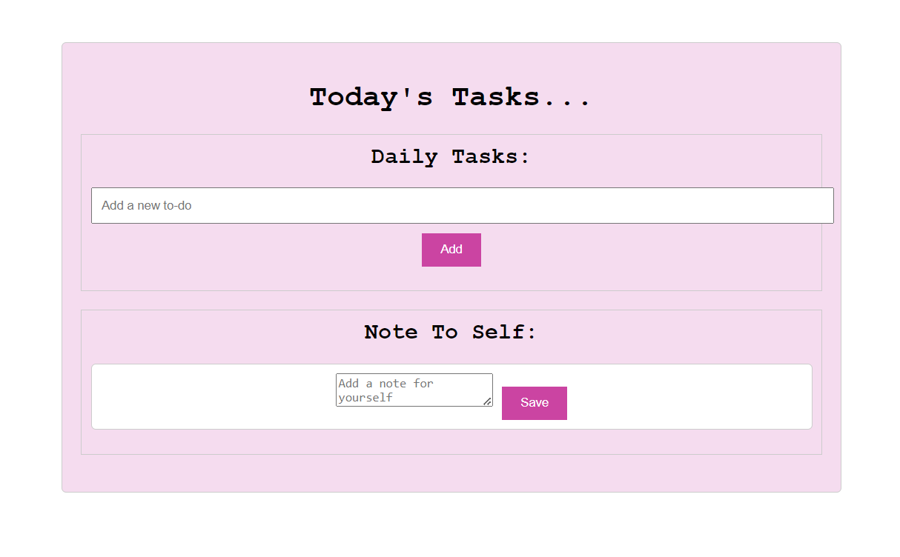

# Simple Todo List and Note Taking App

This is a simple web application that allows users to create a todo list for the day and write notes to themselves. The application is built using HTML, CSS, and JavaScript, and it utilizes AWS S3 buckets for file storage.

## Web Page 

## Features

- Add and delete todos: Users can enter their todos for the day and mark them as completed or delete them when they are done.
- Add and delete notes: Users can write notes to themselves and delete them if needed.
- Local storage: Todos and notes are saved in the browser's local storage, allowing users to access their lists even after refreshing the page.
- AWS S3 integration: The project integrates with AWS S3 buckets to upload the JavaScript file to a publicly accessible bucket.

## Prerequisites

Before running the application, make sure you have the following prerequisites:

- Web browser: Any modern web browser such as Google Chrome, Mozilla Firefox, or Microsoft Edge.
- AWS account: You will need an AWS account to create an S3 bucket and obtain the necessary credentials.

## Getting Started

To get started with the application, follow these steps:

1. Clone the repository or download the source code to your local machine.
2. Open the `index.html` file in a web browser.
3. You should see the todo list and note-taking interface.
4. Enter your todos for the day and write notes as needed.
5. Use the delete buttons to remove todos or notes from the list.
6. The todos and notes are automatically saved to the browser's local storage.
7. To upload the JavaScript file to an S3 bucket, follow the next section.

## Uploading JavaScript File to AWS S3

To upload the JavaScript file to an AWS S3 bucket for public access, follow these steps:

1. Create an S3 bucket in your AWS account with the name "my-todo-list-bucket".
2. Open the `bucket-policy.json` file and replace `<your-bucket-name>` with "my-todo-list-bucket".
3. Open the AWS Management Console and navigate to your S3 bucket.
4. Go to the bucket's Permissions and select "Bucket Policy."
5. Replace the existing policy with the content of the modified `bucket-policy.json` file.
6. Save the bucket policy.
7. Open the `script.js` file and replace `<your-bucket-name>` with "my-todo-list-bucket".
8. Save the changes to the `script.js` file.
9. Refresh the application in your web browser.
10. You should be able to access the uploaded `script.js` file from your S3 bucket.

## Contributing

Contributions to this project are welcome. If you have any ideas, suggestions, or bug reports, please open an issue or submit a pull request.

## License

This project is licensed under the [MIT License](LICENSE).

## Acknowledgements

- [AWS SDK for JavaScript](https://aws.amazon.com/sdk-for-javascript/) - Used for AWS S3 integration.
- [Font Awesome](https://fontawesome.com/) - Used for the delete button icons.

## Contact

If you have any questions or need further assistance, please feel free to contact me at [loisobrero@gmail.com](mailto:loisobrero@gmail.com).
